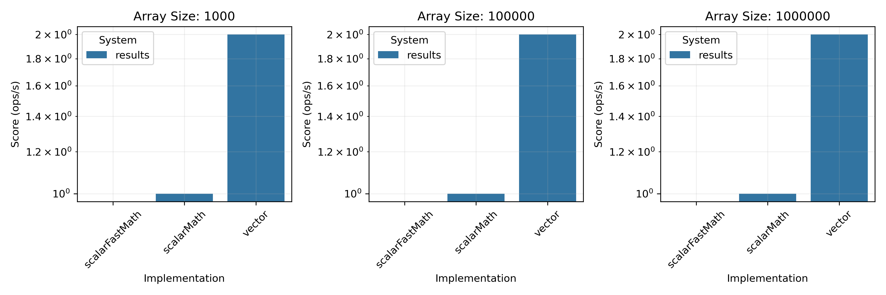
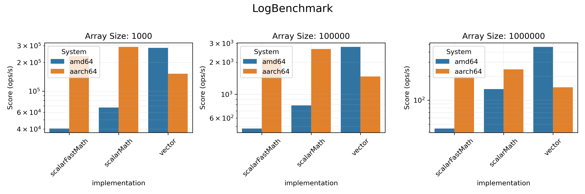
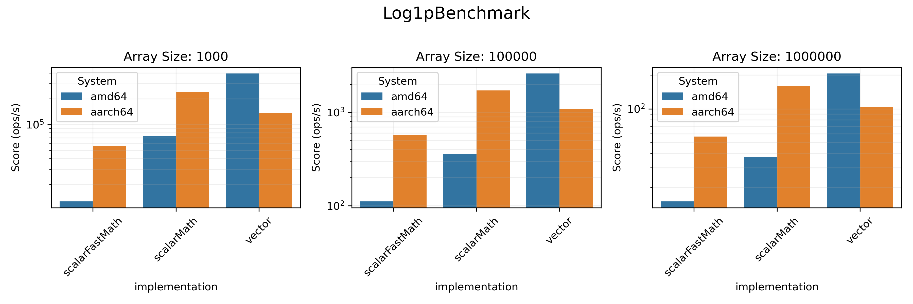
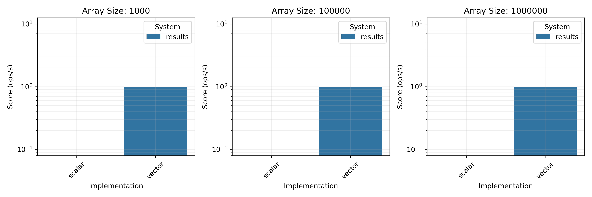
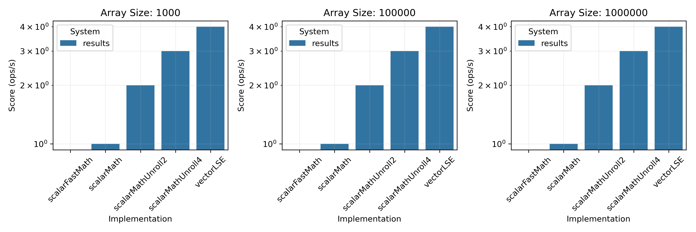

# viktor Benchmarks

We designed a series of [JMH](https://openjdk.java.net/projects/code-tools/jmh/) micro-benchmarks to compare `viktor`'s
SIMD efficiency to that of a simple Kotlin/Java loop.

The microbenchmark code can be found in `src/jmh` folder. To run the benchmarks, run
the following commands from `viktor`'s root folder:

```bash
$ ./gradlew jmh
```

This will create a file `build/jmh/results.csv`, copy it into `amd64.csv` or `aarch64.csv` for visualization.
Next, launch the command line:

```bash
$ python plot_benchmarks.py amd64.csv aarch64.csv
```

## Benchmark Environment

We conducted the benchmarking on two machines:
a laptop running on Apple MacBook Pro M4 Max
and a desktop running on Intel(R) Core(TM) i7-7700K.
The following table summarizes the main features of both:

 machine           | laptop                                              | desktop                                                           
-------------------|-----------------------------------------------------|-------------------------------------------------------------------
 architecture      | `aarch64`                                           | `amd64`                                                           
 CPU               | Apple M4 Max                                        | Intel Core i7-7700K                                               
 cores<sup>1</sup> | 16                                                  | 8                                                                 
 OS                | Sequoia 15.5                                        | Ubuntu 22.04 LTS                                                  
 JVM               | OpenJDK Runtime Environment Homebrew (build 21.0.7) | OpenJDK Runtime Environment (build 21.0.7+6-Ubuntu-0ubuntu122.04) 

<sup>1</sup> The number of cores shouldn't matter since all benchmarks ran in a single thread.

## Benchmark Results

The following data is provided for informational purposes only.
In each benchmark, we considered arrays of size `1000`, `100_000` and `1_000_000`.
We investigate two metrics:

* `Array ops/s` is the number of times the operation was performed on the entire array
  per second. Shown on a logarithmic scale.

### Math Benchmarks

The task here was to calculate exponent (logarithm, `expm1`, `log1p` respectively)
of all the elements in a double array. It was done either with a simple loop,
or with a dedicated `viktor` array method (e.g. `expInPlace`). We also evaluated the
efficiency of
[
`FastMath`](https://commons.apache.org/proper/commons-math/javadocs/api-3.3/org/apache/commons/math3/util/FastMath.html)
methods compared to Java's built-in `Math`.

We also measured the performance of `logAddExp` method for adding
two logarithmically stored arrays. It was compared with the scalar `logAddExp`
defined in `viktor`.






### Statistics Benchmarks

We tested the `sum()`, `sd()` and `logSumExp()` methods here. We also measured
the throughput of a dot product of two arrays (`dot()` method). All these benchmarks
(except for `logSumExp`) don't have a loop-based `FastMath` version since they only
use arithmetic operations in the loop.





## Conclusions
* On `amd64` architecture vectorized realisation provides a visible boost in performance in almost all benchmarks.
* On `aarch64`, only `SumBenchmark` and `SDBenchmark` benefit from vectorization. 