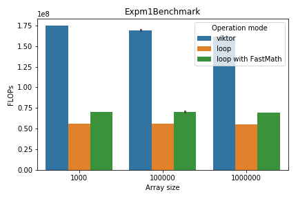
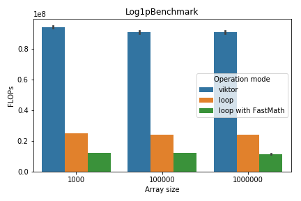

# viktor Benchmarks

We designed a series of microbenchmarks to compare `viktor`'s
native SIMD optimization efficiency to that of a simple Kotlin/Java loop.

The microbenchmark code can be found in `src/jmh` folder. To run the benchmarks, run
the following commands from `viktor`'s root folder:
```bash
$ ./gradlew clean assemble benchmarkJar
$ java -jar ./build/libs/viktor-benchmark.jar
```
You can add the usual [JMH](https://openjdk.java.net/projects/code-tools/jmh/)
command line arguments to the latter command, e.g. `-o` to specify
the output file or `-t` to control the number of threads.

## Benchmark Environment

We conducted the benchmarking on two machines:
a laptop running on Intel Core i7-6820HQ CPU at 2.70GHz
and a server running on Intel Xeon E5-2690 at 2.90GHz.
The following table summarizes the main features of both:

machine | laptop | server
--------|--------|-------
CPU | Intel Core i7-6820HQ | Intel Xeon E5-2690
frequency | 2.70GHz | 2.90 GHz
cores[^cores] | 8 | 32
architecture | `amd64` | `amd64`
highest SIMD extension[^simd] | `AVX` | `SSE2`
OS | Ubuntu 18.04.3 LTS | CentOS Linux 7 (Core)

[^cores]: The number of cores shouldn't matter since all benchmarks ran in a single thread.

[^simd]: The most advanced extension that was used by `viktor`. In reality, the laptop
  had `AVX2` and the server had `SSE4.2` as the highest extension.
  
## Benchmark Results

The following data is provided for informational purposes only.
In each benchmark, we considered arrays of size `1000`, `100_000` and `1_000_000`.
We investigate two metrics:
* `Array ops/s` is the number of times the operation was performed on the entire array
  per second. Shown on a logarithmic scale.
* `FLOPS` is the number of equivalent scalar operations performed per second. It is equal
to `Array ops/s` multiplied by `Array size`. Shown on a linear scale.  

### Math Benchmarks

The task here was to calculate exponent (logarithm, `expm1`, `log1p` respectively)
of all the elements in a double array. It was done either with a simple loop,
or with a dedicated `viktor` array method (e.g. `expInPlace`). We also evaluated the
efficiency of
[`FastMath`](https://commons.apache.org/proper/commons-math/javadocs/api-3.3/org/apache/commons/math3/util/FastMath.html)
methods compared to Java's built-in `Math`.

We also measured the performance of `logAddExp` method for adding
two logarithmically stored arrays. It was compared with the scalar `logAddExp`
defined in `viktor`.

#### Laptop

Array ops/s | FLOPS 
------------|------
 | 
 | 
 | 
 | 
 | 

#### Server

Array ops/s | FLOPS 
------------|------
 | 
 | 
 | 
 | 
 | 

### Statistics Benchmarks

We tested the `sum()`, `sd()` and `logSumExp()` methods here. We also measured
the throughput of a dot product of two arrays (`dot()` method). All these benchmarks
(except for `logSumExp`) don't have a loop-based `FastMath` version since they only
use arithmetic operations in the loop.

#### Laptop

Array ops/s | FLOPS 
------------|------
 | 
 | 
 | 
 | 

#### Server

Array ops/s | FLOPS 
------------|------
 | 
 | 
 | 
 | 

## Cautious Conclusions

`viktor` seems to perform better than the
regular scalar computation approach. The difference can reach up to `57x` (`logSumExp`
on `AVX` _vs_ that computed with a `Math` loop).
The only notable exception to that seems to be, curiously, the same exact
`logSumExp` using `FastMath`, which is a little faster than `viktor`'s
`logSumExp()` on `SSE2` on a `1M`-sized array.